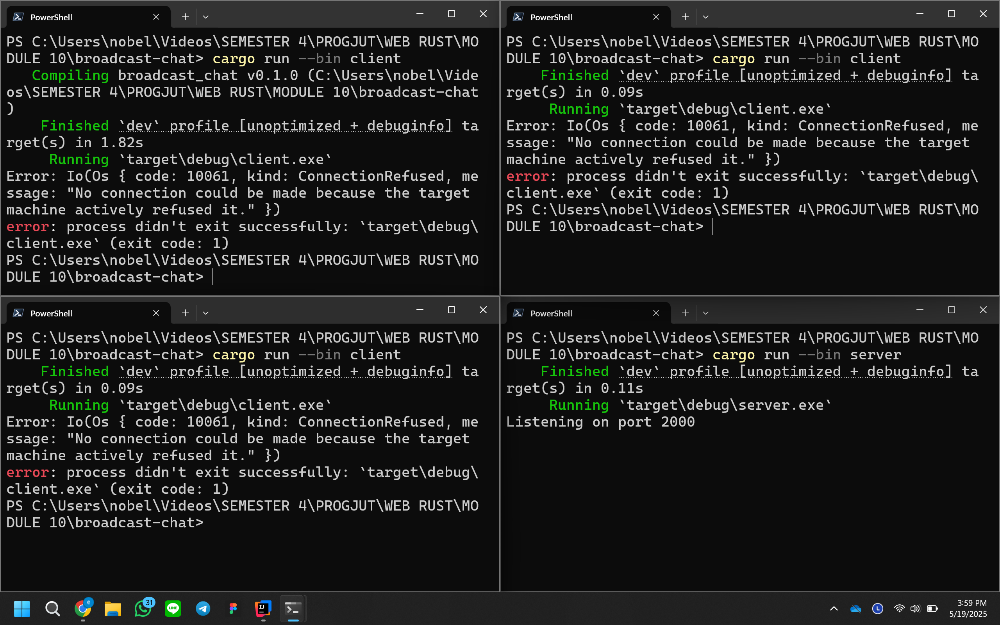
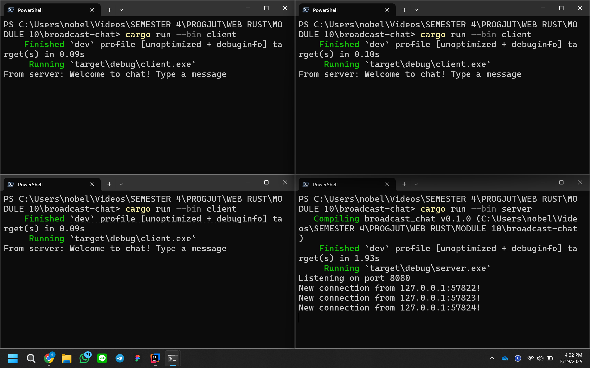

# 1

Pada gambar di atas, dapat terlihat bahwa ketika seorang client mengirim pesan, pesan itu akan diterima oleh server, lalu server membagikannya ke semua client yang sedang terhubung, termasuk si pengirim pesan. Ini bisa terjadi karena server selalu mengingat siapa saja yang sudah terhubung, dan akan terus menunggu sampai ada salah satu client yang mengirim pesan. Begitu ada pesan masuk, server langsung menyebarkannya ke semua client yang tersambung.

# 2

Pada gambar di atas, port yang digunakan oleh client dan server berbeda. Server menunggu koneksi pada port 2000, sementara client mencoba terhubung ke sebuah websocket yang berjalan di port 8080. Namun, karena tidak ada websocket aktif di port 8080, client mengalami error ConnectionRefused. Error ini menunjukkan bahwa client sudah berusaha beberapa kali menghubungi websocket di port tersebut, tetapi koneksi tidak pernah berhasil terjalin.

# 3

Setelah port server diubah dari 2000 menjadi 8080, client bisa kembali terhubung dengan server seperti semula. Namun, berbeda dengan client yang menggunakan protokol websocket untuk berkomunikasi, server hanya mendengarkan koneksi TCP pada port 8080. Koneksi tersebut kemudian diubah menjadi stream websocket melalui proses pemrograman di kode server.