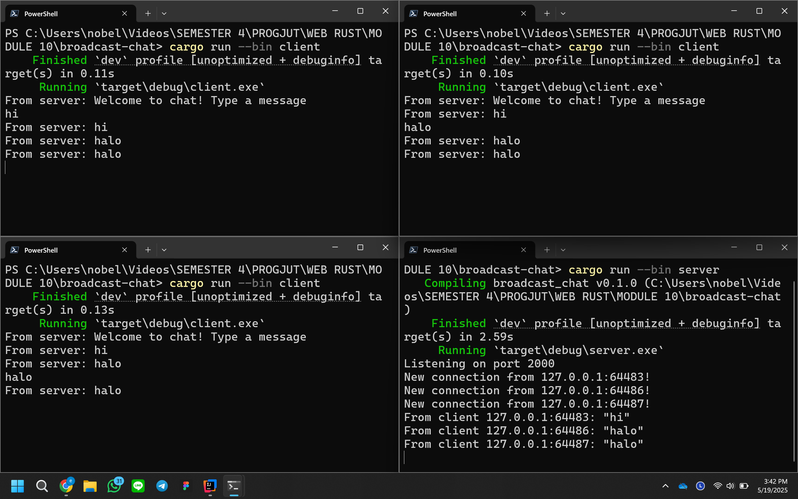

# 1

Pada gambar di atas, dapat terlihat bahwa ketika seorang client mengirim pesan, pesan itu akan diterima oleh server, lalu server membagikannya ke semua client yang sedang terhubung, termasuk si pengirim pesan. Ini bisa terjadi karena server selalu mengingat siapa saja yang sudah terhubung, dan akan terus menunggu sampai ada salah satu client yang mengirim pesan. Begitu ada pesan masuk, server langsung menyebarkannya ke semua client yang tersambung.